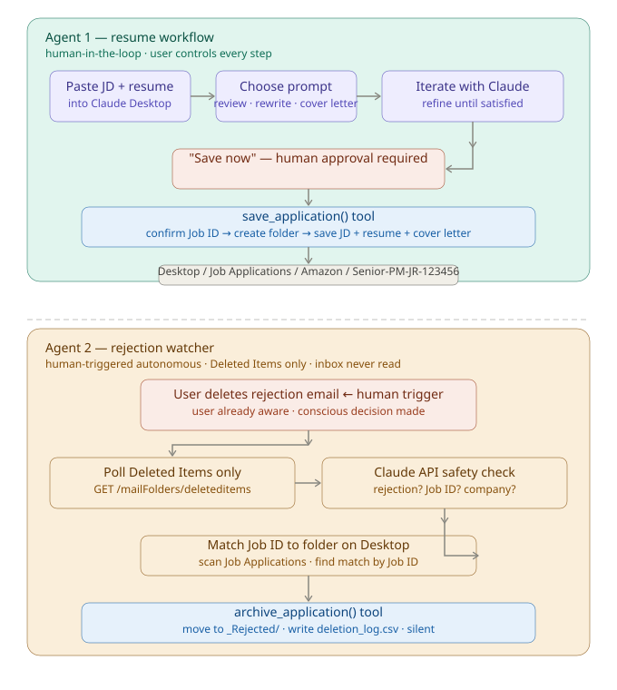
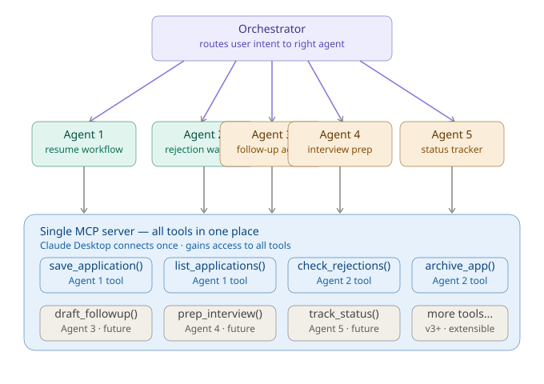

# Product Spec — Job Application Agent
**Author:** Lalitha Pammi, Product Manager  
**Version:** 1.1  
**Status:** Agent 1 shipped · Agent 2 in progress · Multi-agent architecture planned  
**Last updated:** April 2026

---

## The Origin

Two things collided to spark this idea.

The first was a post by a tech executive describing how AI could be used to organize a desktop — not just search it, but actively structure it, name things, keep it clean. That idea stuck: what if AI didn't just answer questions but actively managed the artifacts of knowledge work?

The second was a pattern observed during job searching. Resume match scoring tools suggested keyword changes to improve match percentages. The result felt wrong — resumes started reading as inflated and generic rather than authentically representing real experience. The goal was AI that helps present genuine skills better, not game an algorithm. On top of that, every session customizing a resume and cover letter manually using Claude ended the same way — files in Downloads, no structure, no easy way to find what was sent where. The intentional approach was right, but the infrastructure to support it did not exist.

The insight: job seekers in 2026 are already using LLMs like Claude and ChatGPT to customize their resumes. That behavior is established. What nobody had built was the layer on top — something that captures those customized artifacts, organizes them, and manages the lifecycle automatically. No external service. No subscription. Full control.

---

## Problem Statement

### The job seeker's pain today

Most job seekers applying in 2026 face three distinct frustrations:

**1. Loss of control**
Auto-apply tools and resume inflation services apply on their behalf, often sending generic or keyword-stuffed resumes that don't represent them authentically. They have no visibility into what version of their resume went where.

There is a legitimate argument for auto-apply — in a competitive market, applying early increases visibility and some roles close within hours. This product does not dismiss that reality. However, it serves a different segment: job seekers who believe quality and authenticity outperform volume, particularly for mid-senior roles where recruiters scrutinize fit closely. For this user, applying with a tailored resume is a deliberate strategy, not a limitation.

**2. Disorganization**
Even job seekers who customize their own resumes end up with a chaotic file system — `resume_v3_final_FINAL_amazon.docx`, scattered cover letters, no way to quickly reference what they submitted for a specific role.

**3. Paying when there's no income**
Job search services charge monthly subscriptions regardless of whether the user is actively searching. When you're unemployed, paying $30-50/month for a tool you might not need next month is a real friction point.

---

## User Research

### Methodology
Informal interviews conducted at job seeker networking events in early 2026. Two personas emerged consistently.

---

### Persona 1 — The Intentional Applicant
**Role:** Mid-career Product Manager, actively job searching  
**Behavior:** Uses Claude to customize resume and cover letter for each application manually. Deliberately avoids auto-apply tools and keyword inflation services — believes the job seeker is responsible for what goes on their resume before it reaches a recruiter. Applies selectively and wants every application to authentically represent their experience.  
**Key quote:** *"I want to have control on when and what I update my resume to, instead of relying on external services."*  
**Pain points:**
- Paying for job search services with no guaranteed ROI when there is no income
- Manual file organization after every application eats time and creates confusion
- No single place to see everything applied to
- Keyword inflation tools produce resumes that feel unreal and don't represent the candidate honestly
- Existing AI resume tools push toward automation and volume — there is no tool built for the intentional, quality-first job seeker
- No guardrails around AI-generated content — tools rewrite resumes without the candidate's knowledge or consent

---

### Persona 2 — Melissa
**Role:** Fellow job seeker, mid-career professional  
**Behavior:** Uses AI tools to update her resume for each role. Attended job seeker networking events looking for better tools and strategies.  
**Key insights from conversation:**
- Already uses AI to update resume for every application — the workflow exists, it just needs structure
- Struggles to stay organized during the job search — loses track of which resume version went to which company
- Frustrated by auto-apply tools — feels they misrepresent her and remove her agency
- Wants more control over her applications — wants to know exactly what was sent, to whom, and when

**Validation:** Melissa's frustrations independently mirrored those of Persona 1 — discovered through separate conversations at different events. This was not an isolated experience — it was a consistent pattern across the target segment.

---

## Why Now

Three conditions align in 2026 that make this the right moment:

**1. LLM adoption is mainstream for job seekers**
90% of active job seekers are using Claude, ChatGPT, or Copilot to customize their resumes. The behavior is already there — they just lack the infrastructure layer on top of it.

**2. MCP is emerging as the universal standard**
Anthropic's Model Context Protocol, now open-sourced under the Linux Foundation, allows AI agents to connect directly to local filesystems, email, and cloud storage. This makes a locally-run, platform-agnostic agent possible without building a SaaS product.

**3. The market gap is real**
Existing tools either charge recurring subscriptions, take control away from the user, or require uploading personal documents to third-party servers. There is no lightweight, AI-native, user-controlled solution that lives inside the tools job seekers already use.

---

## Solution

### Job Application Agent

An MCP server that lives inside Claude Desktop (and eventually ChatGPT and Copilot) and automates the job application lifecycle — from resume customization to organized file storage to human-confirmed rejection cleanup.

**Core philosophy:** Meet users where they already are. No new app to download, no new account to create, no subscription to pay for. The agent plugs into the LLM the user already uses and adds structure to a workflow they are already doing.

**Responsible AI philosophy:** The agent never acts without the user's knowledge. It does not rewrite resumes from scratch, invent experience, or apply on the user's behalf. Every AI action is transparent, reversible, and grounded in what the user has already written. The human stays in control at every step.

**Scalability philosophy:** The product is built on a single MCP server that grows over time. Each new agent capability is added as a new MCP tool — Claude Desktop connects to the server once and automatically gains access to every tool. This means adding a new agent does not require a new server, a new connection, or any reconfiguration. The server is the stable foundation. Agents and tools are layered on top of it as the product evolves.

---

## Architecture



### Agent 1 — Resume Workflow (shipped)
**Pattern: Human-in-the-loop** — the user controls every step. The agent assists and executes, but nothing happens without explicit user intent. The "save now" trigger is a deliberate confirmation, not an automatic action.

```
User pastes JD + resume into Claude Desktop
        ↓
Preloaded prompts guide the workflow
(review · rewrite · cover letter)
        ↓
User says "save now" ← human approval required
        ↓
MCP tool extracts company + role + Job ID from JD
Confirms Job ID with user before saving
        ↓
Creates folder: Desktop/Job Applications/Company/Role-JobID/
Saves: job_description.txt · resume.txt · cover_letter.txt
```

**MCP primitives used:**
- `save_application()` — tool
- `list_applications()` — tool
- `review_resume` — prompt
- `rewrite_resume` — prompt
- `write_cover_letter` — prompt
- `save_now` — prompt

**Key design decisions:**
- Job ID as the primary key — no database needed, folder name is the lookup key
- Prompt guards — all prompts check for JD and resume before proceeding
- Existing folders respected — agent checks before creating, never overwrites
- Responsible AI guardrails — rewrite prompt explicitly instructs Claude to use only experience already in the resume, never invent or inflate
- Authentic over optimized — prompts instruct Claude to preserve the user's voice, not keyword-optimize for ATS systems

---

### Agent 2 — Rejection Watcher (in progress)
**Pattern: Human-triggered autonomous** — the user's own action (deleting the rejection email) is the trigger. The agent watches only the Deleted Items folder, not the full inbox. Claude API acts as a safety check, not the primary signal. Once triggered, the agent executes cleanup fully autonomously.

```
Rejection email arrives in Outlook
        ↓
User reads it — already aware of the rejection
        ↓
User deletes the email ← this is the human trigger
        ↓
Agent polls Deleted Items folder every few hours
        ↓
Finds new deleted email
Claude API safety check:
"Is this a job rejection? Which Job ID? Which company?"
If no  → ignore
If yes → match Job ID to folder on Desktop
        ↓
Archives folder → Desktop/Job Applications/_Rejected/
Writes to deletion_log.csv
        ↓
Silent, clean, no interruption needed
```

**MCP primitives added:**
- `archive_application()` — tool, archives matched folder and writes to log

**Key design decisions:**
- Human-triggered autonomous — user's email deletion is the intent signal, not a separate confirmation step
- Minimal data exposure — agent reads only Deleted Items folder via `GET /me/mailFolders/deleteditems/messages`, never the full inbox
- Scoped access — OAuth scope is `Mail.Read` but implementation explicitly calls only the Deleted Items endpoint. This is auditable — the code is open source and verifiable
- Classification as safety net — Claude API verifies before acting, but the human already made the decision
- Soft delete — moves to `_Rejected/` folder, never permanently deletes
- Audit log — every archival is recorded so nothing is lost silently
- Responsible AI — agent never reads the full inbox, only what the user has already chosen to discard
- Single MCP server — archive_application() lives in server.py alongside Agent 1 tools

---

## Extensibility Design



The product currently has two agents sharing a single MCP server. This is a deliberate design choice — not just for today, but to make adding future agents straightforward.

**How it works today:**
```
Agent 1 — Resume Workflow
├── save_application()      human-in-the-loop tool
└── list_applications()     human-in-the-loop tool

Agent 2 — Rejection Watcher
├── check_rejections()      surfaces pending actions to user
└── archive_application()   executes on user confirmation
```

**Why one server matters:**
Claude Desktop connects to the MCP server once. Every tool registered on that server is immediately available — no new configuration, no new connections. Adding a new agent capability means adding new tools to the same server. That's it.

**Where this leads (v3+):**
```
Follow-up agent    → draft_followup() tool
Interview prep     → prep_interview() tool
Status tracking    → track_status() tool
```

When enough agents exist, an orchestrator prompt can route between them based on user intent. That is a v3 decision — not something built prematurely into v1 or v2.

---

## Tech Stack

| Layer | Technology |
|---|---|
| MCP server | Python + FastMCP |
| Package management | uv |
| LLM platform | Claude Desktop (v1) |
| Email reading | Microsoft Graph API + MSAL OAuth |
| Email classification | Anthropic Claude API |
| Background scheduler | Python `schedule` library |
| File storage | Local filesystem (v1) |
| Memory | Folder name as key (no DB) |

---

## Product Roadmap

### v1 — shipped
- Agent 1 fully working in Claude Desktop
- 4 preloaded prompts
- Folder creation with Job ID naming
- Error handling and input validation
- Responsible AI guardrails — rewrites based only on existing resume, never invents experience
- Human-in-the-loop confirmation before every save action

### v2 — Agent 2 (in progress)
- Rejection watcher via Outlook OAuth
- Human-triggered autonomous pattern — email deletion is the trigger
- Agent watches Deleted Items only — minimal inbox exposure
- Claude API classification as safety net
- archive_application() MCP tool
- Deletion log and audit trail
- User chooses storage location at setup:
  - Local Desktop
  - SharePoint

### v3 — expanded lifecycle + orchestration
- Additional agents: follow-up, interview prep, status tracking
- Each new agent adds tools to the existing MCP server
- Orchestrator prompt routes between agents based on user intent
- Status tracking: applied → interviewing → offer → rejected
- Application analytics: response rate by company type, role level, industry

### v4 — multi-platform (future)
- ChatGPT Custom GPT support
- Microsoft Copilot agent support
- Single MCP server works across all three platforms
- Install once, use everywhere

---

## Open Questions for v2

- How do we handle rejection emails that do not include a Job ID?
- What is the right default storage location for non-technical users?
- Should we add a simple onboarding flow for first-time setup?
- How do we handle the scheduler running when the machine is asleep?
- What if the user deletes a non-rejection email from a job-related company?
- How long should the agent look back in Deleted Items — 24 hours, 48 hours?
